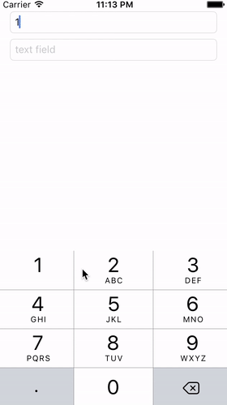

# PLCurrencyTextField

[](https://swift.org)



## Summary

`PLCurrencyTextField` provide simple and user friendly support for the amount in the currency.

## Usage

To start using the component add it to your project using CocoaPods, Carthage or manually then to create `PLCurrencyTextField` intance put `UITextField` using *Interface builder* and change its class to `PLCurrencyTextField` in *Identity inspector* or do it from code.

### Configuration

* `minimumFractionDigits` - Configure the minium fraction digits count that will be used by the internal number formatter
* `maximumFractionDigits` - Configure the maximum fraction digits count that will be used by the internal number formatter
* `locale` - Configure locale that will be used by the internal number formatter

### Helpers

* `numberValue` - Returns current number value

## Requirements

Swift 2.2, iOS 8.0

## Installation

### CocoaPods

[CocoaPods](http://cocoapods.org) is a dependency manager for Cocoa projects. You can install it with the following command:

```bash
$ gem install cocoapods
```

To integrate PLCurrencyTextField into your Xcode project using CocoaPods, specify it in your `Podfile`:

```ruby
source 'https://github.com/CocoaPods/Specs.git'
platform :ios, '9.0'
use_frameworks!

target '<Your Target Name>' do
    pod 'PLCurrencyTextField'
end
```

Then, run the following command:

```bash
$ pod install
```

### Carthage

[Carthage](https://github.com/Carthage/Carthage) is a decentralized dependency manager that builds your dependencies and provides you with binary frameworks.

You can install Carthage with [Homebrew](http://brew.sh/) using the following command:

```bash
$ brew update
$ brew install carthage
```

To integrate PLCurrencyTextField into your Xcode project using Carthage, specify it in your `Cartfile`:

```ogdl
github "PLCurrencyTextField"
```

Run `carthage update` to build the framework and drag the built `PLCurrencyTextField.framework` into your Xcode project.

### Manual

You can download the latest files from our [Releases page](https://github.com/nonameplum/PLCurrencyTextField/releases). After doing so, drag `PLCurrencyTextField.xcodeproj` into your project in Xcode, and for your project target on ***General*** tab in ***Embedded Binaries*** section add `PLCurrencyTextField.framework`. Example project is configured the same way, so you have the crib sheet.

## Author

Łukasz Śliwiński

Twitter: [sliwinskilukas](https://twitter.com/sliwinskilukas)

## License

**PLCurrencyTextField** is under MIT license. See [LICENSE](LICENSE) for details.
